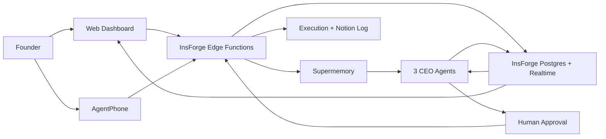

# GroundTruth

GroundTruth is a founder decision engine for high-stakes operating questions. A founder can text in a problem, GroundTruth gathers company context, three CEO agents debate different plans, and the founder approves or rejects the recommendation before execution.

Live demo: [groundtruth-blush.vercel.app](https://groundtruth-blush.vercel.app/)

## How It Works

## Core Stack

- **Supermemory** provides persistent company memory and evidence retrieval.
- **AgentPhone** lets founders start and approve decisions from their phone.
- **InsForge** handles state, realtime updates, and the orchestration workflow.

## Repository

- `frontend/` contains the React dashboard.
- `insforge/functions/` contains the edge-function workflow.
- `migrations/` contains the database schema.
- `demo-script.md` contains the live demo script.
